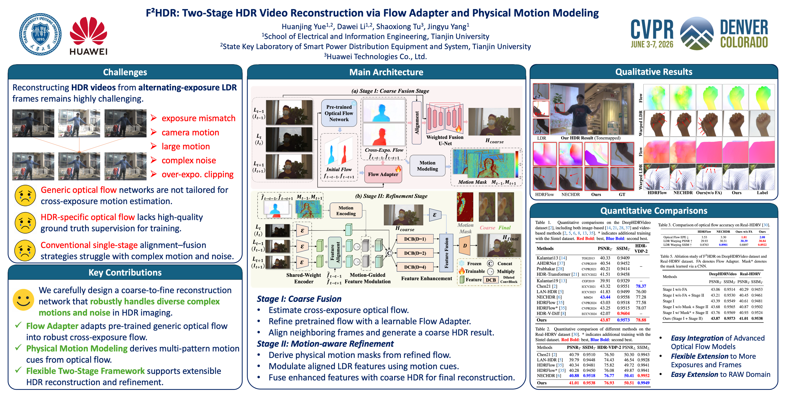

<div align="center">

# F²HDR: Two-Stage HDR Video Reconstruction via Flow Adapter and Physical Motion Modeling

**CVPR 2026**

Huanjing Yue, Dawei Li, Shaoxiong Tu, Jingyu Yang

[](https://openaccess.thecvf.com/content/CVPR2026/html/Yue_F2HDR_Two-Stage_HDR_Video_Reconstruction_via_Flow_Adapter_and_Physical_CVPR_2026_paper.html)
[](https://arxiv.org/abs/2603.14920)
[](https://www.youtube.com/watch?v=7KgkS_g2qG8)



</div>

---

## Installation

```bash
conda create -n f2hdr python=3.12
conda activate f2hdr
pip install torch==2.7.0 torchvision==0.22.0 torchaudio==2.7.0 --index-url https://download.pytorch.org/whl/cu128
pip install -r requirements.txt
```

## Data Preparation

**Training set:** [Vimeo-90K](http://toflow.csail.mit.edu/) (`vimeo_septuplet`).

**Test sets:**

- [DeepHDRVideo](https://github.com/guanyingc/DeepHDRVideo-Dataset): download `dynamic_RGB_data_2exp_release` and `static_RGB_data_2exp_rand_motion_release`.
- [Real-HDRV](https://github.com/yungsyu99/Real-HDRV): download `Real-HDRV-Testing.zip` and unzip to obtain `Test_Compack_8frames_50scenes`.

Organize the datasets as:

```
F2HDR/data
├── vimeo_septuplet
│   ├── sequences
│   ├── sep_testlist.txt
│   └── sep_trainlist.txt
├── dynamic_RGB_data_2exp_release
├── static_RGB_data_2exp_rand_motion_release
└── Test_Compack_8frames_50scenes
```

## Pretrained Models

Download our pretrained F²HDR checkpoint from [Baidu Netdisk](https://pan.baidu.com/s/1rIHBOyq1ds_S7CBso7oyOw?pwd=qqhn) (code: `qqhn`) and the SEA-RAFT weight `Tartan-C-T-TSKH-spring540x960-M.pth` from [Google Drive](https://drive.google.com/drive/folders/1YLovlvUW94vciWvTyLf-p3uWscbOQRWW?usp=sharing). Place them under `pretrained_models/`:

```
F2HDR/pretrained_models
├── checkpoint.pth
└── sea_raft
    └── Tartan-C-T-TSKH-spring540x960-M.pth
```

## Testing

Evaluate on the DeepHDRVideo dynamic benchmark:

```bash
python test.py --dataset DeepHDRVideo \
    --dataset_dir ./data/dynamic_RGB_data_2exp_release \
    --pretrained_model ./pretrained_models/checkpoint.pth \
    --save_dir ./test_results/deephdrvideo_dynamic
```

Evaluate on the DeepHDRVideo static (random-motion) benchmark:

```bash
python test.py --dataset DeepHDRVideo \
    --dataset_dir ./data/static_RGB_data_2exp_rand_motion_release \
    --pretrained_model ./pretrained_models/checkpoint.pth \
    --save_dir ./test_results/deephdrvideo_static
```

Evaluate on the Real-HDRV benchmark:

```bash
python test.py --dataset RealHDRV \
    --dataset_dir ./data/Test_Compack_8frames_50scenes \
    --pretrained_model ./pretrained_models/checkpoint.pth \
    --ref_exp alternate \
    --save_dir ./test_results/real_hdrv
```

## Training

Train F²HDR on Vimeo-90K with per-epoch validation on DeepHDRVideo dynamic:

```bash
python train.py \
    --dataset_vimeo_dir ./data/vimeo_septuplet \
    --dataset_chen_val_dir ./data/dynamic_RGB_data_2exp_release \
    --logdir ./experiments/f2hdr_2E
```

## Citation

```bibtex
@InProceedings{Yue_2026_CVPR,
    author    = {Yue, Huanjing and Li, Dawei and Tu, Shaoxiong and Yang, Jingyu},
    title     = {F{\textasciicircum}2HDR: Two-Stage HDR Video Reconstruction via Flow Adapter and Physical Motion Modeling},
    booktitle = {Proceedings of the IEEE/CVF Conference on Computer Vision and Pattern Recognition (CVPR)},
    month     = {June},
    year      = {2026},
    pages     = {33985-33994}
}
```

## Acknowledgements

Our code is built upon [HDRFlow](https://github.com/OpenImagingLab/HDRFlow), [SEA-RAFT](https://github.com/princeton-vl/SEA-RAFT), [SAFNet](https://github.com/ltkong218/SAFNet), [Real-HDRV](https://github.com/yungsyu99/Real-HDRV), and [DeepHDRVideo](https://github.com/guanyingc/DeepHDRVideo). We thank the authors for their excellent work.
